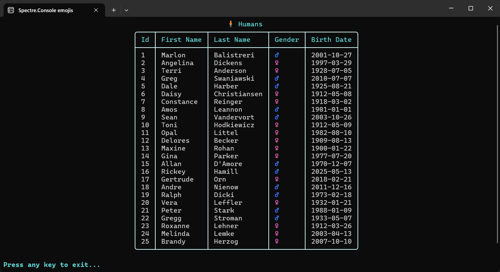

# About

Provides an alternative to display text with emojis in a console application using `Spectre.Console`.

- Creates a list of `Human` using `BogusLibrary`
- Displays emojis based on the `Gender` of each `Human` in a foreach loop using a `Spectre.Console` table



## Requires

NuGet package [Spectre.Console](https://www.nuget.org/packages/Spectre.Console/0.50.0?_src=template)

## Emojis setup

See `Classes\Program.cs`

```csharp
Console.OutputEncoding = new UTF8Encoding(encoderShouldEmitUTF8Identifier: false);
Console.InputEncoding = Encoding.UTF8;
```

[Emoji Reference](https://spectreconsole.net/console/reference/emoji-reference)

## Data

Comes from `BogusLibrary` project.